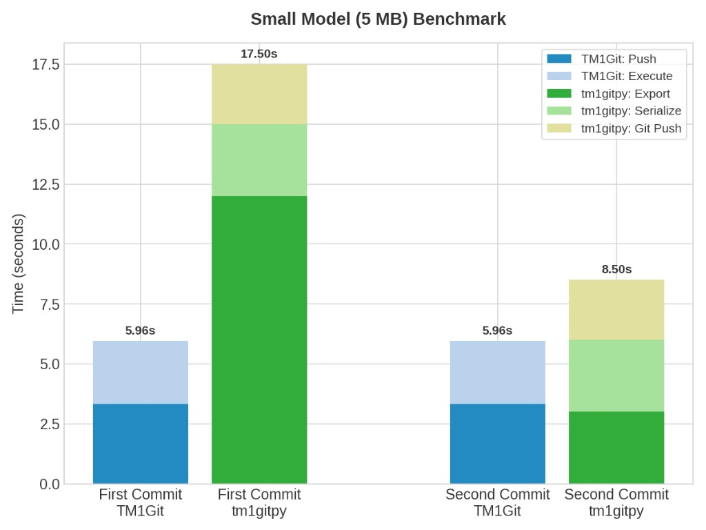
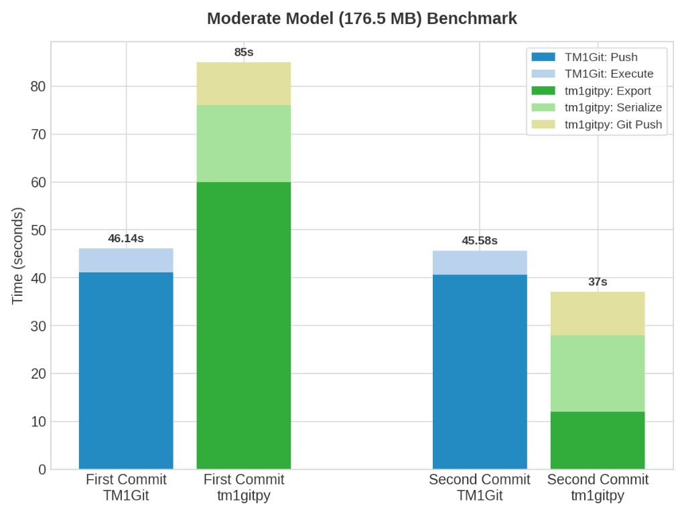
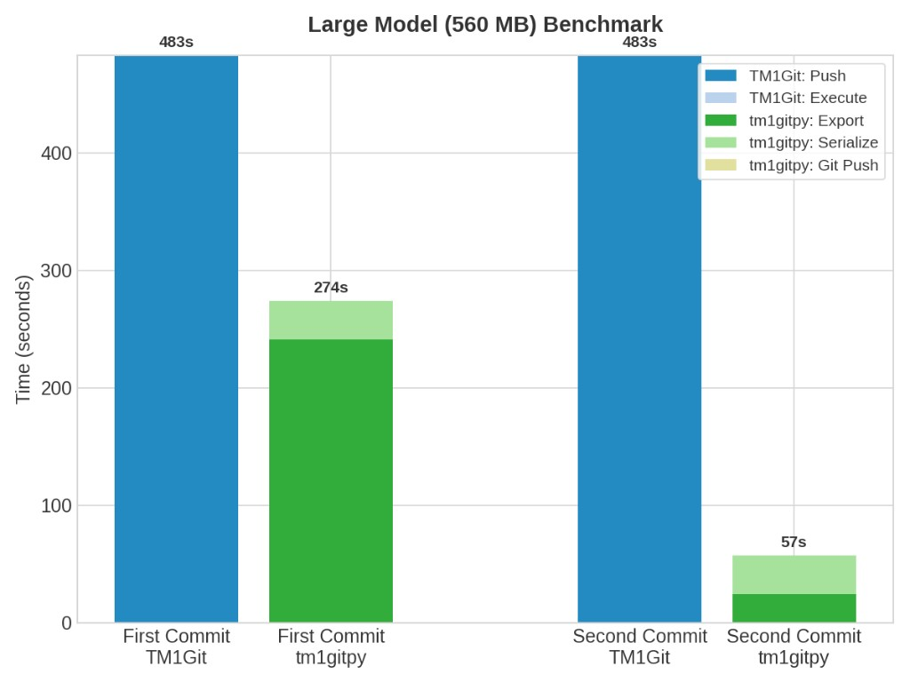
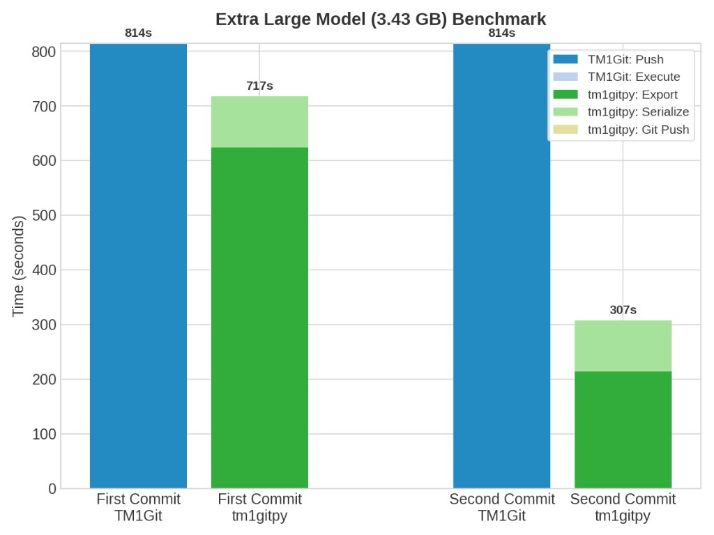

# tm1_git_py

[)](https://github.com/KnowledgeSeed/tm1_git_py/actions/workflows/ci.yml)
[](https://github.com/KnowledgeSeed/tm1_git_py/actions/workflows/ci.yml)
[](https://github.com/KnowledgeSeed/tm1_git_py/releases/latest)

**tm1_git_py** is a Python-based drop-in replacement for TM1 Git. It keeps TM1 Git’s on-disk file layout so you can move between tools with minimal friction.

- It understands `tm1project.json` and the same filtering rules used by TM1 Git workflows.
- It is **not** embedded in TM1, which keeps deployment flexible—ideal for CI/CD, agents, and pipelines that run outside the TM1 server. It talks to TM1 over the REST API **via TM1py**.
- You can run it as a **stand-alone command-line tool** or **import it as a library** and embed it in a larger ecosystem (automation, CI/CD, custom apps).

## Features

`tm1_git_py` allows you to:
- Export TM1 models (cubes, dimensions, processes, chores) to a structured folder format compatible with TM1 Git
- Apply filter rules during **export** (narrowed objects and SQLite-backed export cache), during **compare** (fine-grained changeset without mutating on-disk exports), or on a **changeset** (toggle `apply` flags only)
- Compare models (either file-based schema or TM1 servers) and collect differences to changesets.
- Apply changsets to target server

## TM1 Git vs tm1gitpy: Technical Comparison

A detailed technical comparison between **TM1git** and **TM1gitpy**, categorized by capability areas.

| Feature Category | Feature | TM1git | tm1gitpy |
| :--- | :--- | :--- | :--- |
| **Core Architecture** | **Embeddable** | ✅ (via REST API) | ✅ (as a Python package) |
| | **CLI Support** | ❌ (only REST API over CLI or Postman) | ✅ |
| **Schema & Objects** | **Model Schema Export** | ✅ | ✅ |
| | **Object Deletes** | ❌ | ✅ |
| | **Settings (Server Config)** | ✅ | 🟠 Upcoming release |
| | **Files** | ✅ | ❌ (only via Python hooks) |
| **Filtering Capabilities** | **Basic Filtering** | ✅ (`tm1project.json`) | ✅ (`tm1project.json` or separate rules) |
| | **Advanced Filtering** | ❌ (no wildcard support for technical object unignores, no trailing wildcards) | ✅ (wildcard support for technical object unignores; leading/trailing wildcards on any level) |
| | **Element-level Filtering** | ❌ | ✅ |
| | **Rule Markups** | ❌ | 🟠 Upcoming release |
| **Changeset Management** | **Changeset as a file** | ❌ (requires Git PR to review changes) | ✅ |
| | **Changeset Post-filtering** | ❌ | ✅ |
| | **Transactional Changeset apply** | ✅ | 🟠 Upcoming release |
| | **Progress Tracking** | ❌ | ✅ |
| **DevOps & Extensibility** | **Pre/Post Pull/Push** | ✅ (via TI processes) | 🟠 Upcoming release (via TI processes or Python hooks) |
| | **No-Git Preview Mode** | ❌ | ✅ |


## Benchmarks

### Benchmark Section 1: Small and Moderate Models





### Benchmark Section 2: Large and Extra Large Models






## Installation

### From Source

To **use** the package (runtime dependencies only):

```bash
git clone <repository-url>
cd tm1_git_py
pip install -e .
```

Or install from a requirements file: `pip install -r requirements.txt` then `pip install -e .`

To **run tests** or develop (runtime + test dependencies):

```bash
pip install -r requirements-dev.txt
# or
pip install -e ".[dev]"
```

### Requirements

- Python 3.10 or higher
- TM1py >= 2.1, < 3.0
- requests >= 2.25
- PyYAML >= 6.0

## Configuration

Create a configuration file at `.tm1gitpy/tm1servers.yaml` (local directory) or `~/.tm1gitpy/tm1servers.yaml` (user home):

```yaml
servers:
  dev:
    base_url: http://localhost:12354/api/v1/
    user: admin
    password: your_password  # Optional - can use environment variables
  
  prod:
    base_url: https://prod-server.company.com:12354/api/v1/
    user: admin
    password: ${TM1_PROD_PASSWORD}  # Environment variable placeholder
```

## Usage

### Export TM1 Model

Export a full TM1 model from a server:

```bash
python tm1_git_py/main.py export --server dev --model-output-folder model_dir --overwrite
```

### Filtering

Use the same rule language in three places:

- **Export** (`-f` / `--filter`): rules are applied while pulling from TM1 and affect the export folder and internal SQLite-backed cache for that export. To change what is on disk after an export, re-run export with updated rules (there is no separate “filter folder only” command).

```bash
python tm1_git_py/main.py export --server dev --model-output-folder model_dir --filter file://examples/filter.txt --overwrite
```

- **Compare** (`--filter-rules`): rules narrow what appears in the emitted changeset; they do not rewrite serialized model folders.

- **Changeset filter** (`changset-filter` / `changeset-filter`, `--filter-rules`): toggles `apply` flags on matching changes in place; changeset length is unchanged.

```bash
python tm1_git_py/main.py changset-filter --changeset-path changeset.yml --filter-rules file://examples/filter.txt
```

Filter file format (one pattern per line, `#` for comments):

```
# Exclude technical dimensions
Dimensions('}*')

# Force-include all BW dimensions
!Dimensions('BW*')

# Exclude BW Comp dimensions
Dimensions('BW Comp*')

# Exclude technical hierarchies for all dimensions
Dimensions('*')/Hierarchies('}*')

# Chore task rules target the underlying process_name
Chores('Daily*')/Tasks('LoadData')
```

#### Filter Rule Logic

- Each rule line is a TM1 URL-style selector, optionally prefixed with `!`.
- No prefix means **exclude**.
- `!` prefix means **force include**.
- Wildcards in quoted identifiers are supported:
  - `a*` -> starts with `a`
  - `*a` -> ends with `a`
  - `a` -> exact match
- Rules are evaluated per entity level (dimensions, hierarchies, elements, subsets, cubes, views, processes, chores, tasks).
- Hierarchy traversal is parent-first, with force-include branch retention:
  - normally, excluded parent excludes descendants
  - if a descendant is force-included (`!`), its required parent chain is retained
    (e.g. force-include element keeps matching hierarchy and dimension references)
- At each level, filter expression is composed as:
  - base excludes: `not (<exclude_1>) and not (<exclude_2>) and ...`
  - plus force includes: `or (<include_group>)`
  - effective shape: `(not (<exclude_1>) and not (<exclude_2>) and ...) or (<include_group>)`
- TM1 export filters inherit force-includes from descendants:
  - a force-included hierarchy contributes include criteria to the dimension-level TM1 filter
  - a force-included element/subset/edge contributes include criteria to the hierarchy-level TM1 filter

#### Supported Rule Patterns

| Level | Pattern |
| --- | --- |
| Dimension | `Dimensions('<pattern>')` |
| Hierarchy | `Dimensions('<dim_pattern>')/Hierarchies('<hier_pattern>')` |
| Element | `Dimensions('<dim_pattern>')/Hierarchies('<hier_pattern>')/Elements('<elem_pattern>')` |
| Subset | `Dimensions('<dim_pattern>')/Hierarchies('<hier_pattern>')/Subsets('<subset_pattern>')` |
| Edge | `Dimensions('<dim_pattern>')/Hierarchies('<hier_pattern>')/Edges(...)` |
| Cube | `Cubes('<pattern>')` |
| View | `Cubes('<cube_pattern>')/Views('<view_pattern>')` |
| Rule | `Cubes('<cube_pattern>')/Rules(...)` |
| Process | `Processes('<pattern>')` |
| Chore | `Chores('<pattern>')` |
| Task | `Chores('<chore_pattern>')/Tasks('<process_name_pattern>')` |

Use `!` prefix on any supported pattern to force-include matching objects.

#### Rule Pattern Shortcuts

Collection segments without `('<pattern>')` are treated as `('*')`.

- `Cubes/Views` means `Cubes('*')/Views('*')`
- `Dimensions/Hierarchies/Elements` means `Dimensions('*')/Hierarchies('*')/Elements('*')`
- `Processes` means `Processes('*')`

#### Filter Rule Input Formats (CLI)

- **`export`**: `-f` / `--filter` — file path, `file://` URI, or comma-separated rules (same loaders as below).
- **`compare`**: `-f` / `--filter-rules` — same three input forms.
- **`changset-filter`** and **`changeset-filter`** (alias): `--filter-rules` — same three input forms.

For those flags:

- File path: `examples/filter.txt`
- File URI: `file://examples/filter.txt`
- Inline comma-separated rules:
  `Dimensions('}*'),!Dimensions('BW*')`

### Command-Line Arguments

```
python tm1_git_py/main.py <command> [options]

Commands:
  export           Export model from TM1 to a folder
  compare          Compare two model folders and write a changeset
  apply            Apply a changeset file to a TM1 server
  changset-filter  Toggle apply flags in a changeset using filter rules
                   (alias: changeset-filter)

Shared options (all commands):
  --log-file PATH  Optional log file path (or directory for timestamped logs)
  --console-logs   Enable console log output in addition to progress UI
  --debug          Enable detailed worker/thread progress bars

export:
  -s, --server SERVER
  -mo, --model-output-folder PATH   (default: export)
  -o, --overwrite
  -f, --filter RULES_OR_FILE
  --max-workers N

compare:
  --source PATH
  --target PATH
  -o, --output PATH                 (default by format: changeset.yaml/json)
  --mode {full,add_only}            (default: full)
  -f, --filter-rules RULES_OR_FILE
  --format {yaml,json}              (default: yaml)
  --max-workers N

apply:
  -s, --server SERVER
  -c, --changeset PATH
  --status-dir PATH
  --execution-id ID
  --no-fail-fast

changset-filter / changeset-filter:
  --changeset-path PATH
  --filter-rules RULES_OR_FILE
```

Logging defaults to `INFO`. You can also set `TM1GITPY_LOG_LEVEL` in the environment. Pass `--debug` to set the log level to `DEBUG` for that run.

Progress output shows a total progress bar by default. Pass `--debug` to also render detailed per-worker/thread progress bars.

Worker counts are split into two worker types:
- `cpu-worker`: process-based workers used for CPU-bound work such as content hashing.
- `io-worker`: thread-based workers used for IO-bound work such as TM1 page fetching.

`--max-workers` means the total CPU + IO worker budget. When it is provided:
- `cpu-worker ~= --max-workers / 4`
- `io-worker = --max-workers - cpu-worker`
- the split is rounded to stay near a 1:3 CPU/IO ratio

When `--max-workers` is omitted:
- `cpu-worker = cpu_count // 2 + 1`
- `io-worker = cpu-worker * 3`

When the resolved CPU worker count is `1`, content hashing and model serialization run serially.

For `export`, content hash calculation uses CPU workers and TM1 fetch/page work uses IO workers. For `compare`, the resolved CPU worker count is split between source and target model deserialization:
- source workers = `max(1, cpu_workers // 2)`
- target workers = `max(1, cpu_workers - source_workers)`
- odd values give one extra worker to target

## Examples

See the [examples](examples/) directory for usage examples:
- [config_usage.py](examples/config_usage.py) - Server configuration examples
- [filter.txt](examples/filter.txt) - Filter pattern examples

For model comparison and changeset workflows, use the Python API (`tm1_git_py.comparator`, `tm1_git_py.changeset`, `tm1_git_py.apply`).

For paginated element/subset fetching (e.g., large hierarchies), use `tm1_git_py.get_elements`, `tm1_git_py.get_subsets`, and related functions.

## Building Binary

Build a standalone executable using Nuitka:

```bash
python -m nuitka tm1_git_py/main.py --follow-imports --no-deployment-flag=self-execution --mode=onefile --output-filename=tm1gitpy
```

## Development

### Running Tests

```bash
pytest tests/
```

Integration tests (TM1 container/local TM1 required):

```bash
PYTHONPATH=. pytest test_integration/
```

## License


See LICENSE file for details.
